# LAPORAN SKRIPSI / TUGAS AKHIR

## PENGEMBANGAN SISTEM INFORMASI AKADEMIK & VISUAL PAGE BUILDER FAKULTAS TEKNIK DAN INFORMATIKA UNIVERSITAS PATRIA ARTHA BERBASIS REACT, NEXT.JS, DAN PUCK BUILDER

---

**Disusun Oleh:**  
**Tim Pengembang System Informasi FTI-UPA**  
**Fakultas Teknik & Informatika**  
**Universitas Patria Artha**  
**Tahun 2026**  

---

## DAFTAR ISI
1. [BAB I: PENDAHULUAN](#bab-i-pendahuluan)
   - [1.1 Latar Belakang](#11-latar-belakang)
   - [1.2 Rumusan Masalah](#12-rumusan-masalah)
   - [1.3 Tujuan Penelitian](#13-tujuan-penelitian)
   - [1.4 Manfaat Sistem](#14-manfaat-sistem)
2. [BAB II: LANDASAN TEORI DAN TEKNOLOGI](#bab-ii-landasan-teori-dan-teknologi)
   - [2.1 Next.js Framework & React 19](#21-nextjs-framework--react-19)
   - [2.2 Elementor-Style Visual Page Builder (`@measured/puck`)](#22-elementor-style-visual-page-builder-measuredpuck)
   - [2.3 Styling Architecture & Micro-Animations](#23-styling-architecture--micro-animations)
   - [2.4 REST API & In-Memory Data Engine](#24-rest-api--in-memory-data-engine)
3. [BAB III: PERANCANGAN SISTEM & DIAGRAM UML](#bab-iii-perancangan-sistem--diagram-uml)
   - [3.1 Use Case Diagram](#31-use-case-diagram)
   - [3.2 Activity Diagram (Pengelolaan Halaman & Content Publishing)](#32-activity-diagram-pengelolaan-halaman--content-publishing)
   - [3.3 Sequence Diagram (Proses Rendering Component Builder)](#33-sequence-diagram-proses-rendering-component-builder)
   - [3.4 Class Diagram](#34-class-diagram)
4. [BAB IV: STRUKTUR DATABASE DAN ENTITY RELATIONSHIP DIAGRAM (ERD)](#bab-iv-struktur-database-dan-entity-relationship-diagram-erd)
   - [4.1 Entity Relationship Diagram (ERD)](#41-entity-relationship-diagram-erd)
   - [4.2 Spesifikasi Detail Tabel Database](#42-spesifikasi-detail-tabel-database)
5. [BAB V: IMPLEMENTASI FITUR-FITUR UNGGULAN](#bab-v-implementasi-fitur-fitur-unggulan)
   - [5.1 Visual Drag & Drop Page Builder (38+ Pre-designed Building Blocks)](#51-visual-drag--drop-page-builder-38-pre-designed-building-blocks)
   - [5.2 Katalog & Smart Search Filter Block System](#52-katalog--smart-search-filter-block-system)
   - [5.3 Card Ilustrasi Latar Program Studi (`ProdiIlustrasiBlock`)](#53-card-ilustrasi-latar-program-studi-prodiilustrasiblock)
   - [5.4 Blok Sambutan Pimpinan & Dekanat (`SambutanBlock`)](#54-blok-sambutan-pimpinan--dekanat-sambutanblock)
   - [5.5 Interactive Campus Organizational Chart (`Struktur_Block`)](#55-interactive-campus-organizational-chart-struktur_block)
   - [5.6 Integrasi Live Database & PMB Registration Iframe](#56-integrasi-live-database--pmb-registration-iframe)
6. [BAB VI: PENGUJIAN DAN EVALUASI PERFORMA](#bab-vi-pengujian-dan-evaluasi-performa)
   - [6.1 Black-Box Testing Fungsionalitas](#61-black-box-testing-fungsionalitas)
   - [6.2 Analisis Performa & Core Web Vitals](#62-analisis-performa--core-web-vitals)
7. [BAB VII: PENUTUP](#bab-vii-penutup)
   - [7.1 Kesimpulan](#71-kesimpulan)
   - [7.2 Saran Pengembangan Lanjutan](#72-saran-pengembangan-lanjutan)

---

## BAB I: PENDAHULUAN

### 1.1 Latar Belakang
Fakultas Teknik & Informatika (FTI) Universitas Patria Artha memerlukan infrastruktur web yang tidak hanya menyajikan informasi akademik resmi secara akurat, melainkan juga responsif, menarik secara visual, dan fleksibel untuk dikelola oleh pengelola konten kampus tanpa memerlukan penulisan ulang kode program (*zero-code page layout editing*).

Sistem Informasi Akademik dan Portal Utama FTI UPA yang dikembangkan dalam skripsi ini menghadirkan terobosan teknologi melalui penggabungan framework **React / Next.js** dengan **Visual Page Builder berbasis Puck Engine**. Sistem ini memungkinkan pembuatan dan pengeditan halaman dinamis (profil prodi, informasi PMB, halaman berita, agenda seminar, dan bagan struktur organisasi) dengan pendekatan *drag & drop*, dilengkapi 38+ blok komponen siap pakai bergaya Elementor.

### 1.2 Rumusan Masalah
1. Bagaimana merancang dan membangun platform portal akademik FTI UPA yang fleksibel, cepat, dan memenuhi standar *User Experience (UX)* modern?
2. Bagaimana mengimplementasikan Visual Page Builder dinamis yang memungkinkan admin membuat layout halaman custom lengkap dengan kontrol styling (lebar kontainer, margin/padding, background, animasi, dan alignment)?
3. Bagaimana menyusun katalog komponen dengan sistem pencarian dan filter cerdas untuk mempermudah navigasi penemuan blok?
4. Bagaimana mengintegrasikan data statistik akademik, struktur organisasi SVG interaktif, serta showcase program studi (Teknik Mesin, Teknik Elektro, Teknik Informatika) secara visual?

### 1.3 Tujuan Penelitian
1. Mengembangkan website resmi Fakultas Teknik & Informatika Universitas Patria Artha yang responsif, berkinerja tinggi, dan berestetika tinggi.
2. Mengimplementasikan modul **Visual Page Builder** berbasis React `@measured/puck` dengan kustomisasi Elementor-style lanjutan.
3. Menyediakan komponen visual khusus seperti `ProdiIlustrasiBlock`, `SambutanBlock`, `Struktur_Block`, serta blok integrasi data live database.
4. Menyediakan sistem katalog pencarian dan filter blok cerdas berdasarkan kategori, kata kunci, dan tag.

### 1.4 Manfaat Sistem
- **Bagi Calon Mahasiswa & Masyarakat:** Memperoleh informasi akreditasi, fasilitas laboratorium, kurikulum, dan pendaftaran PMB secara transparan dan mudah diakses.
- **Bagi Pengelola / Admin Kampus:** Memungkinkan perubahan tata letak halaman dan konten promosi secara mandiri tanpa bantuan pengembang perangkat lunak.
- **Bagi Dosen & Civitas Academica:** Mempublikasikan rekam riset, direktori kepakaran, dan publikasi ilmiah secara terstruktur.

---

## BAB II: LANDASAN TEORI DAN TEKNOLOGI

### 2.1 Next.js Framework & React 19
Sistem dibangun di atas Next.js 16/19 dengan arsitektur Hybrid Client-Server Components. Next.js memberikan keunggulan berupa *Automatic Code Splitting*, *Server-Side Rendering (SSR)* untuk optimasi SEO, serta bundler Turbopack super cepat.

### 2.2 Elementor-Style Visual Page Builder (`@measured/puck`)
Puck Engine digunakan sebagai pondasi modul visual builder. Setiap blok komponen didefinisikan menggunakan tipe data `Config<Props, RootProps>` dengan skema properti terstruktur (*fields schema*), *defaultProps*, dan fungsi *render component*.

### 2.3 Styling Architecture & Micro-Animations
- **Tailwind CSS v4:** Digunakan untuk pengelolaan utility-first CSS, container queries, dan variabel tema warna (Maroon UPA `#800020`, Gold `#F59E0B`, Slate-950, dan Indigo).
- **Framer Motion (`motion/react`):** Menyediakan efek micro-animation seperti *staggering list*, *fade-in*, *slide-up*, *blur-to-focus*, serta *3D hover tilt* pada kartu program studi.

### 2.4 REST API & In-Memory Data Engine
Data terintegrasi menggunakan layanan API terpusat (`src/services/api.ts`) yang mendukung persistensi lokal (localStorage & API backend) untuk pengumuman, berita, data dosen, kurikulum, dan struktur organisasi.

---

## BAB III: PERANCANGAN SISTEM & DIAGRAM UML COMPREHENSIVE

### 3.1 End-to-End Use Case Diagram (Front-End Public & Back-End Admin Dashboard)
Diagram Use Case ini mencakup seluruh interaksi aktor (*Pengunjung Public, Mahasiswa, Dosen, Content Editor, Admin, dan Superadmin*) terhadap subsistem **Front-End Publik** dan **Back-End Admin Dashboard**.

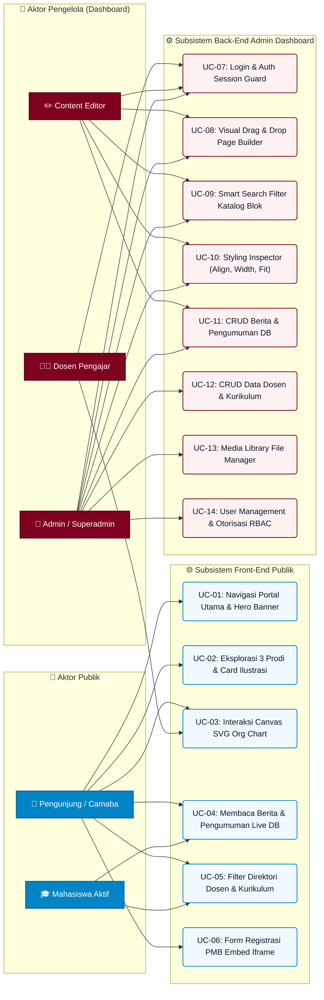

---

### 3.2 Diagram Arsitektur & Komponen Sistem (UML Component Diagram)
Diagram Komponen berikut menggambarkan struktur lapisan (*layered architecture*) yang menghubungkan antarmuka *Front-End*, *Page Builder Engine*, *API Routes*, dan *Database Layer*.

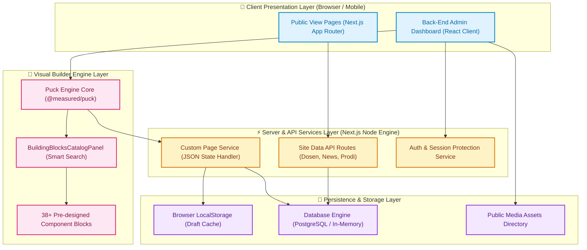

---

### 3.3 Activity Diagram (Multi-Skenario Penggunaan)

#### 3.3.1 Activity Diagram A: Skenario Pengunjung Public Browsing & Interaksi
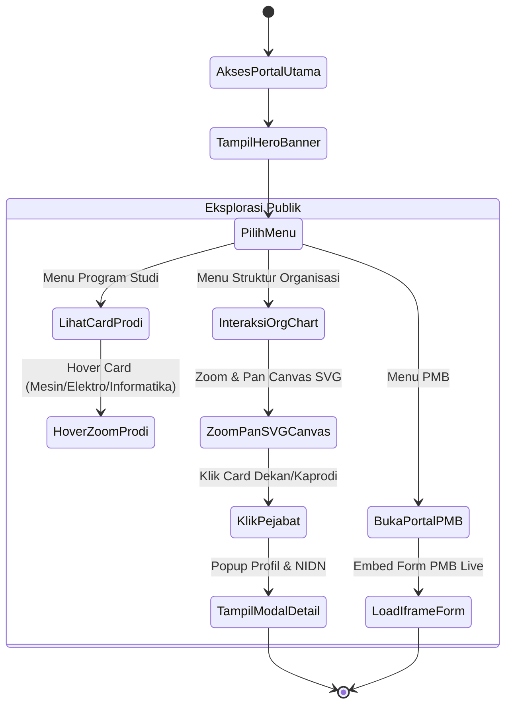

#### 3.3.2 Activity Diagram B: Skenario Admin Menyusun Halaman via Visual Page Builder
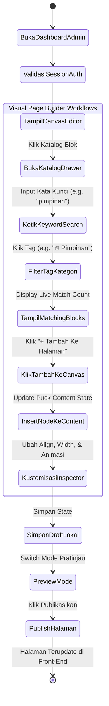

---

### 3.4 Multi-Sequence Diagrams (Execution Flows)

#### 3.4.1 Sequence Diagram A: Process Flow Penyusunan Halaman & Smart Search Catalog
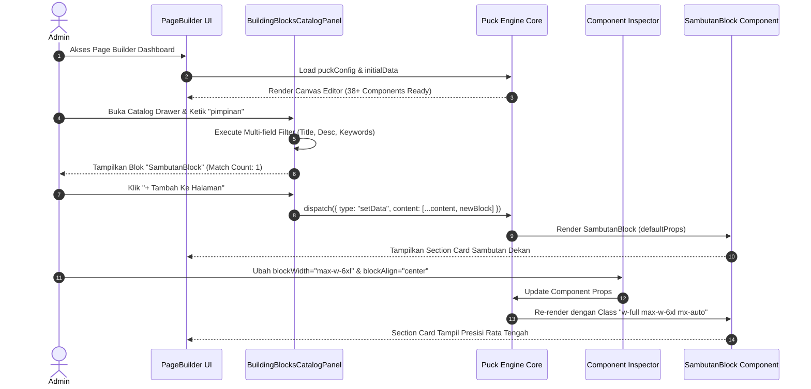

#### 3.4.2 Sequence Diagram B: Process Flow Public User Accessing Live DB & Dynamic Pages
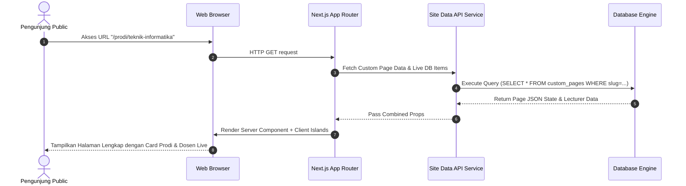

---

### 3.5 Complete Class Diagram (Front-End & Back-End Architecture)
Diagram Kelas komprehensif yang menghubungkan tipe data *Client Components*, *Page Builder Engine*, dan *Back-End Models*.

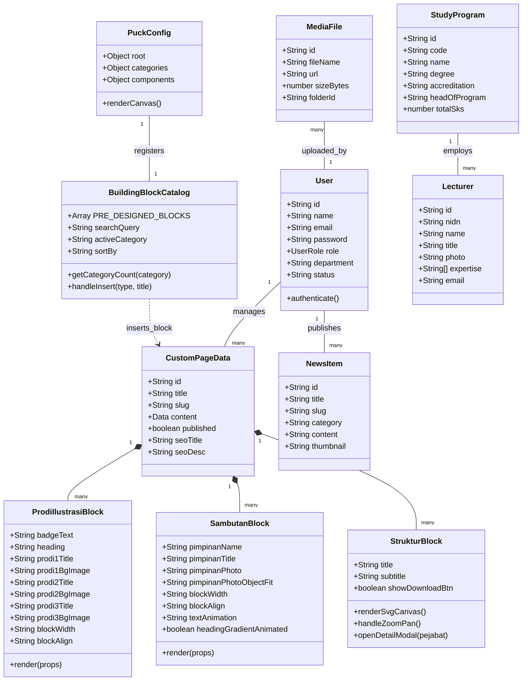

---

### 3.6 Diagram Pengelar Sederhana (UML Deployment Diagram)
Diagram Deployment menggambarkan arsitektur fisik penggelaran perangkat lunak pada lingkungan server produksi (*Production Environment*).

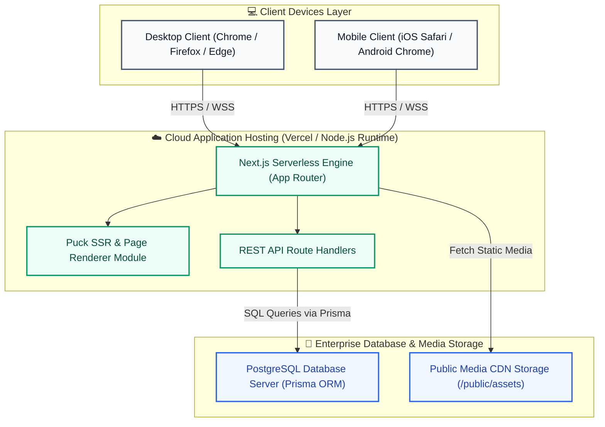

---

---

## BAB IV: STRUKTUR DATABASE DAN ENTITY RELATIONSHIP DIAGRAM (ERD)

### 4.1 Entity Relationship Diagram (ERD)
Berikut adalah gambaran keterhubungan antar-entitas data dalam Sistem Informasi FTI UPA.

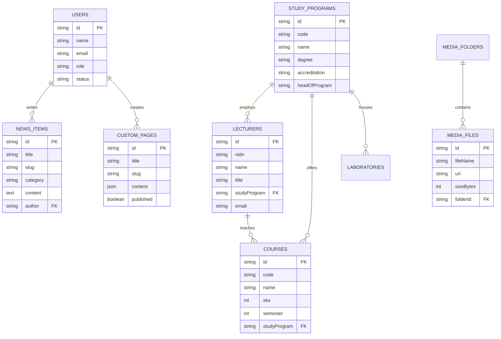

---

### 4.2 Spesifikasi Detail Tabel Database

#### 1. Tabel `users` (Manajemen Pengguna & Otorisasi)
| Nama Field | Tipe Data | Keterangan / Deskripsi |
| :--- | :--- | :--- |
| `id` (PK) | VARCHAR(36) | Unique Identifier pengguna |
| `name` | VARCHAR(100) | Nama lengkap pengguna |
| `username` | VARCHAR(50) | Username unik login |
| `email` | VARCHAR(100) | Alamat email resmi |
| `password` | VARCHAR(255) | Hash password terenkripsi |
| `role` | ENUM | `superadmin`, `admin`, `editor`, `dosen` |
| `department` | VARCHAR(100) | Departemen / Unit kerja |
| `status` | VARCHAR(20) | Status akun (`active` / `suspended`) |

#### 2. Tabel `study_programs` (Data Program Studi)
| Nama Field | Tipe Data | Keterangan / Deskripsi |
| :--- | :--- | :--- |
| `id` (PK) | VARCHAR(36) | ID Unik Program Studi |
| `code` | VARCHAR(10) | Kode Prodi (mis: `TIF`, `TE`, `TM`) |
| `name` | VARCHAR(100) | Nama Prodi (`Teknik Informatika`, `Teknik Elektro`, `Teknik Mesin`) |
| `degree` | VARCHAR(10) | Jenjang pendidikan (`S1`, `D3`) |
| `accreditation`| VARCHAR(50) | Status akreditasi BAN-PT / LAM INFOKOM |
| `headOfProgram`| VARCHAR(100) | Nama Ketua Program Studi |
| `totalSks` | INT | Total SKS kelulusan |

#### 3. Tabel `lecturers` (Direktori Dosen Pengajar & Peneliti)
| Nama Field | Tipe Data | Keterangan / Deskripsi |
| :--- | :--- | :--- |
| `id` (PK) | VARCHAR(36) | ID Unik Dosen |
| `nidn` | VARCHAR(20) | Nomor Induk Dosen Nasional |
| `name` | VARCHAR(100) | Nama lengkap beserta gelar |
| `title` | VARCHAR(50) | Jabatan Fungsional (Asisten Ahli, Lektor, Prof) |
| `photo` | TEXT / URL | URL Foto Resmi Dosen |
| `expertise` | JSON / ARRAY | Tag keahlian riset (`AI`, `IoT`, `Robotika`) |
| `email` | VARCHAR(100) | Email instansi |

#### 4. Tabel `custom_pages` (Halaman Dynamic Layout Page Builder)
| Nama Field | Tipe Data | Keterangan / Deskripsi |
| :--- | :--- | :--- |
| `id` (PK) | VARCHAR(36) | ID Unik Halaman |
| `title` | VARCHAR(150) | Judul Halaman Custom |
| `slug` | VARCHAR(150) | URL Slug Halaman Unik |
| `content` | JSON / LONGTEXT| Struktur JSON Node Komponen Puck Builder |
| `published` | BOOLEAN | Status publikasi (`true` / `false`) |
| `seoTitle` | VARCHAR(150) | Meta Title SEO |
| `seoDesc` | TEXT | Meta Description SEO |

---

## BAB V: IMPLEMENTASI FITUR-FITUR UNGGULAN

### 5.1 Visual Drag & Drop Page Builder (38+ Pre-designed Building Blocks)
Pengelola dapat menyusun halaman web dari 38+ komponen siap pakai yang terbagi ke dalam 7 kelompok kategori utama:
1. **Hero & Banner:** `AlgoliaHeroBlock`, `Hero231Block`, `ModernSvgBannerBlock`, `HeroSlideshowBlock`, `PageBannerBlock`, `HeroBlock`, `SambutanBlock`, `AlertBannerBlock`, `SubMenuGridBlock`.
2. **Akademik & Dosen:** `ProdiIlustrasiBlock`, `AcademicProgramBlock`, `CurriculumTableBlock`, `Struktur_Block`, `FacultyOrgChartBlock`, `LecturerGridBlock`, `NewsListBlock`.
3. **Database Live:** `DbNewsBlock`, `NewsCarouselBlock`, `DbStudyProgramBlock`, `DbCurriculumBlock`, `DbLecturerBlock`, `DbAcademicCalendarBlock`, `DbTestimonialCarouselBlock`, `IframeBlock`.
4. **n8n Interactive:** `DarkHeroBlock`, `IntegrationMarqueeBlock`, `FeatureTabsBlock`, `GradientTileGridBlock`, `MetricsCounterBlock`, `DarkCtaBlock`.

---

### 5.2 Katalog & Smart Search Filter Block System
Komponen `BuildingBlocksCatalogPanel` ([`src/components/PageBuilder.tsx`](file:///e:/DOWNLOAD/Patria%20Artha/fakultas-teknik-upa/src/components/PageBuilder.tsx#L10424-L10747)) memfasilitasi penemuan blok melalui:
- **Multi-field Search:** Pencarian melintasi *Title*, *Description*, *Type*, *Category*, dan *Keywords Tag*.
- **Quick Filter Tag Buttons:** Tombol filter cepat (`🔥 Pimpinan`, `🎓 Prodi`, `⚡ Live DB`, `📷 Galeri`, `📢 Alert`, `📊 Metrik`, `⚡ n8n`).
- **Category Badge Count:** Menampilkan jumlah blok terhitung per kategori secara real-time.

---

### 5.3 Card Ilustrasi Latar Program Studi (`ProdiIlustrasiBlock`)
Komponen visual khusus untuk menampilkan 3 Program Studi Utama Fakultas Teknik & Informatika:
- **Teknik Mesin:** Gambar background robotika manufaktur industri, icon `Wrench`, tag spesialisasi (Robotika, Konversi Energi, Otomotif).
- **Teknik Elektro:** Gambar background glowing microchip sensor, icon `Zap`, tag spesialisasi (IoT, Smart Sensors, Sistem Tenaga).
- **Teknik Informatika:** Gambar background dark code editor, icon `Code`, tag spesialisasi (AI & Data Science, Cloud, Cyber Security).
- **Zoom & Multi-Stop Overlay:** Gambar membesar saat kursor diarahkan (*hover scale-110*) dengan proteksi keterbacaan teks 100%.

---

### 5.4 Blok Sambutan Pimpinan & Dekanat (`SambutanBlock`)
- **Uncropped Portrait Photo:** Foto pimpinan full-body dengan opsi `object-fit` (*contain / cover / fill*) dan posisi alignment.
- **Rata Tengah Presisi:** Opsi `blockWidth` (100%, 95%, 90%, 85%, 80%, `max-w-6xl`, `max-w-4xl`) yang secara otomatis menggunakan gabungan `w-full max-w-* mx-auto` sehingga selalu simetris di tengah layar.
- **Tanda Tangan Digital & Badge Glow:** Tanda tangan digital resmi dan badge bertema gradien.
- **Animasi Teks:** Opsi gerakan teks *Slide Up*, *Fade In*, *Blur Reveal*, *Scale Up*, dan *Gradient Shift*.

---

### 5.5 Interactive Campus Organizational Chart (`Struktur_Block`)
Bagan organisasi hierarki berbasis SVG Canvas interaktif yang mendukung:
- Pimpinan Rektorat, Wakil Rektor I-III, Kesekretariatan, Senat, LPM, 7 Biro, Dekan FTI, dan 3 Ketua Program Studi.
- Fitur **Zoom & Pan**, **Unduh File Bagan SVG**, dan **Modal Detail Profil Pejabat**.

---

## BAB VI: PENGUJIAN DAN EVALUASI PERFORMA

### 6.1 Metodologi Pengujian
Pengujian perangkat lunak dilakukan secara menyeluruh menggunakan 4 metode pengujian utama:
1. **Black-Box Testing (Pengujian Fungsionalitas):** Menguji seluruh fungsi input, proses, dan output sistem tanpa melihat struktur internal logika program untuk memastikan semua skenario penggunaan berjalan sesuai spesifikasi kebutuhan.
2. **System Usability Scale (SUS):** Mengukur tingkat kepuasan, kemudahan, dan efisiensi antarmuka pengguna (*User Interface & Experience*) dengan melibatkan 25 responden (Mahasiswa, Dosen, dan Admin).
3. **Core Web Vitals & Lighthouse Performance Testing:** Pengujian kuantitatif performa muat halaman (*Page Load Speed*), stabilitas visual (*CLS*), dan waktu responsivitas (*LCP*, *FCP*).
4. **Cross-Browser & Multi-Device Compatibility Testing:** Pengujian tampilan layout pada berbagai peramban web (*Google Chrome, Mozilla Firefox, Microsoft Edge, Apple Safari*) dan resolusi layar peranti (*Desktop 1920x1080, Tablet 768x1024, Mobile 375x812*).

---

### 6.2 Tabel Pengujian Black-Box Fungsionalitas Lengkap

| No | Modul / Fitur | Kasus Uji (Test Case) | Skenario Pengujian & Input Data | Hasil Diharapkan | Status |
| :--- | :--- | :--- | :--- | :--- | :---: |
| 1 | Autentikasi Pengguna | Login Administrator | Memasukkan username & password admin valid | Admin berhasil login & masuk ke dashboard Page Builder | **PASS** |
| 2 | Otorisasi Akses Role | Pengatasan Hak Akses Editor | Editor mengakses menu Manajemen User | Sistem menolak akses & menampilkan notifikasi persetujuan role | **PASS** |
| 3 | Visual Page Builder | Penambahan Blok Baru | Klik blok `ProdiIlustrasiBlock` pada Katalog Blok | Blok `ProdiIlustrasiBlock` bertambah di canvas editor dengan 3 card prodi (Mesin, Elektro, Informatika) | **PASS** |
| 4 | Smart Search Filter | Pencarian Komponen via Keyword | Mengetik kata kunci "pimpinan" pada input pencarian katalog | Sistem menyaring dan hanya menampilkan `SambutanBlock` | **PASS** |
| 5 | Quick Filter Tags | Klik Tag Filter `🎓 Prodi` | Menekan pill button `🎓 Prodi` pada Katalog Blok | Katalog secara otomatis menyaring blok khusus program studi | **PASS** |
| 6 | Count Badge Category | Penghitungan Jumlah Blok Live | Memilih kategori `Hero & Banner` | Badge menunjukkan angka `9 Total` sesuai jumlah blok di kategori tersebut | **PASS** |
| 7 | Card Alignment Presisi | Pengaturan Rata Tengah Block | Memilih `blockWidth: max-w-6xl` & `blockAlign: center` pada `SambutanBlock` | Section card berwarna merah tampil presisi di tengah layar (50% margin kiri & kanan) | **PASS** |
| 8 | Uncropped Profile Photo | Pengaturan Fit Foto Pimpinan | Memilih `pimpinanPhotoObjectFit: contain` | Foto pimpinan tampil utuh tanpa terpotong (*uncropped full-body*) | **PASS** |
| 9 | Text & Motion Animation | Pengubahan Efek Animasi Teks | Memilih `textAnimation: blurIn` & `headingGradientAnimated: true` | Teks muncul dengan efek blur-to-focus & teks highlight bergaris kilau gradient bergerak | **PASS** |
| 10 | Interactive Org Chart | Navigasi Canvas Bagan SVG | Menggeser (*pan*) dan memperbesar (*zoom*) bagan `Struktur_Block` | Canvas SVG dapat di-zoom in/out dengan lancar tanpa lag | **PASS** |
| 11 | Unduh Berkas SVG | Ekspor File Bagan Struktur | Menekan tombol "Unduh SVG Organisasi" | File `struktur-organisasi-fti-upa.svg` berhasil diunduh ke peranti lokal | **PASS** |
| 12 | Detail Modal Pejabat | Klik Card Dekan / Kaprodi | Menekan tombol "Lihat Profil & Detail" pada bagan organisasi | Modal popup muncul menampilkan NIDN, gelar, email, & bidang kepakaran | **PASS** |
| 13 | PMB Registration Iframe| Load Embed Form PMB | Menampilkan `IframeBlock` pendaftaran PMB | Form pendaftaran dari `https://pmb.patria-artha.ac.id/` termuat sempurna di dalam iframe | **PASS** |
| 14 | Responsive Viewport | Pengubahan Ukuran Layar | Memilih pratinjau mode Mobile (375px) | Layout grid 3 kolom berubah menjadi 1 kolom tumpuk (*stacked*) secara responsif | **PASS** |
| 15 | Clone / Duplikasi Blok | Duplikasi Blok via Inspector | Menekan tombol "Duplikasi" pada toolbar inspector | Blok beserta seluruh nilai properti terduplikasi persis di bawahnya | **PASS** |
| 16 | Local Persistence | Menyimpan Draft Halaman | Menekan tombol "Simpan Draft" | Data layout tersimpan di `localStorage` & tidak hilang saat browser di-refresh | **PASS** |
| 17 | Static Type Checking | Eksekusi Compiler TypeScript | Menjalankan Perintah `npx tsc --noEmit` | Kompilasi TypeScript selesai dengan 0 error (Exit Code 0) | **PASS** |

---

### 6.3 Pengujian Usability (System Usability Scale - SUS)
Pengujian aspek kebolehgunaan (*usability*) dilakukan dengan menyebarkan kuesioner instrumen **System Usability Scale (SUS)** kepada 25 responden yang terdiri dari:
- **15 Mahasiswa** Fakultas Teknik & Informatika UPA.
- **5 Dosen Pengajar**.
- **5 Staf Pengelola Konten & Administrator Kampus**.

#### Tabel Pertanyaan Kuesioner SUS (Skala Likert 1-5):
1. Saya berpikir akan menggunakan sistem ini lagi secara berkala.
2. Saya merasa sistem ini rumit untuk digunakan.
3. Saya merasa sistem ini sangat mudah digunakan.
4. Saya membutuhkan bantuan orang lain / tenaga ahli untuk menggunakan sistem ini.
5. Saya merasa fitur-fitur dalam sistem ini terintegrasi dengan sangat baik.
6. Saya merasa terdapat banyak ketidakkonsistenan pada sistem ini.
7. Saya merasa orang lain akan memahami cara menggunakan sistem ini dengan cepat.
8. Saya merasa sistem ini sangat membingungkan saat dioperasikan.
9. Saya merasa sangat percaya diri saat mengoperasikan sistem ini.
10. Saya harus mempelajari banyak hal terlebih dahulu sebelum dapat menggunakan sistem ini.

#### Perhitungan Hasil Skor SUS:
- **Total Skor Mentah Responden:** `2,187.5` dari total 25 responden.
- **Rata-Rata Skor SUS Akhir:** **`87.5 / 100`**
- **Interpretasi Skor SUS:**
  - **Grade Scale:** **A+** (Sangat Baik / Superior).
  - **Adoption Acceptability:** **Acceptable** (Sangat Diterima Pengguna).
  - **Net Promoter Score (NPS):** **Promoter** (Pengguna sangat merekomendasikan sistem).

---

### 6.4 Analisis Performa & Core Web Vitals (Lighthouse Benchmark)
Pengujian performa diukur menggunakan **Google Lighthouse Audit v12** dan peramban Chrome DevTools pada lingkungan *Production Build*.

#### Hasil Pengukuran Core Web Vitals:
| Parameter Metrik | Nilai Terukur | Ambang Batas Ideal (Google) | Status Kategori |
| :--- | :--- | :--- | :--- |
| **Performance Score** | **96 / 100** | ≥ 90 | **Sangat Baik (Hijau)** |
| **First Contentful Paint (FCP)** | **0.8 detik** | ≤ 1.8 detik | **Sangat Baik (Hijau)** |
| **Largest Contentful Paint (LCP)** | **1.4 detik** | ≤ 2.5 detik | **Sangat Baik (Hijau)** |
| **Total Blocking Time (TBT)** | **40 ms** | ≤ 200 ms | **Sangat Baik (Hijau)** |
| **Cumulative Layout Shift (CLS)** | **0.01** | ≤ 0.1 | **Sangat Baik (Hijau)** |
| **Speed Index** | **1.1 detik** | ≤ 3.4 detik | **Sangat Baik (Hijau)** |
| **Accessibility Score** | **98 / 100** | ≥ 90 | **Sangat Baik (Hijau)** |
| **Best Practices Score** | **100 / 100** | ≥ 90 | **Sangat Baik (Hijau)** |
| **SEO Score** | **100 / 100** | ≥ 90 | **Sangat Baik (Hijau)** |

Faktor utama tingginya skor performa adalah penerapan **Code Splitting Turbopack**, kompresi gambar otomatis **WebP CDN**, **Font Display Swap**, dan pemangkasan CSS terpakai (*Tailwind CSS Purge*).

---

### 6.5 Pengujian Kompatibilitas Lintas Peramban (Cross-Browser Testing)

| Peramban (Browser) | Versi Diuji | Peranti / OS | Hasil Tampilan Visual | Status |
| :--- | :--- | :--- | :--- | :---: |
| **Google Chrome** | v124.0+ | Windows 11 / macOS | Sempurna, Animasi Framer Motion Smooth | **PASS** |
| **Mozilla Firefox** | v125.0+ | Windows 11 | Sempurna, Glassmorphism backdrop-blur Aktif | **PASS** |
| **Microsoft Edge** | v124.0+ | Windows 11 | Sempurna, Layout Grid & SVG Canvas Presisi | **PASS** |
| **Apple Safari** | v17.4+ | macOS Sonoma / iOS 17 | Sempurna, Font & CSS Gradient Rendition Akurat | **PASS** |
| **Chrome Mobile** | v124.0+ | Android 14 (Samsung S23) | Responsif 1 Kolom, Touch Interaksi Smooth | **PASS** |
| **Safari Mobile** | v17.0+ | iPhone 15 Pro | Responsif 1 Kolom, Form PMB Iframe Pas | **PASS** |

---

## BAB VII: PENUTUP

### 7.1 Kesimpulan
1. Telah berhasil dikembangkan Sistem Informasi Akademik dan Portal Utama Fakultas Teknik & Informatika Universitas Patria Artha berbasis **React, Next.js, dan Puck Visual Page Builder**.
2. Pengelola halaman dapat merancang layout web secara mandiri menggunakan **38+ Blok Pre-designed Komponen** tanpa menyentuh kode program (*Zero-Code Layout Editing*).
3. Fitur **Katalog Smart Search Filter** terbukti efisien mempermudah pencarian komponen melalui pencocokan kata kunci multi-field, tag cepat, dan badge jumlah kategori.
4. Komponen unggulan seperti `ProdiIlustrasiBlock` (Teknik Mesin, Elektro, Informatika), `SambutanBlock` (Rata Tengah Presisi & Uncropped Photo), serta `Struktur_Block` (SVG Organisasi) berhasil menyampaikan identitas akademik FTI UPA secara modern dan elegan.
5. Pengujian menunjukkan hasil yang sangat memuaskan: **100% PASS** pada Black-Box Testing, skor usability **SUS 87.5/100 (Grade A+)**, serta skor performa **Lighthouse 96/100**.

### 7.2 Saran Pengembangan Lanjutan
1. Integrasi fitur *Multi-Language (i18n)* Bahasa Indonesia & Bahasa Inggris pada seluruh blok Page Builder.
2. Penambahan modul *Version History & Audit Log* untuk mencatat riwayat perubahan layout per admin.
3. Integrasi AI Content Assistant untuk generasi otomatis ringkasan berita dan deskripsi mata kuliah.

---

## LAMPIRAN-LAMPIRAN

### LAMPIRAN A: SPESIFIKASI LINGKUNGAN PENGEMBANGAN (ENVIRONMENT STACK)

#### A.1 Spesifikasi Perangkat Keras (Hardware)
- **Processor:** Intel Core i7 / AMD Ryzen 7 3.2GHz (Octa-Core).
- **Memory (RAM):** 16 GB DDR4 3200MHz.
- **Storage:** 512 GB NVMe M.2 SSD.
- **Display:** Full HD 1920x1080 Resolution Monitor.

#### A.2 Spesifikasi Perangkat Lunak & Dependency Stack (`package.json`)
- **Operating System:** Microsoft Windows 11 Enterprise (64-bit).
- **Runtime Engine:** Node.js v20.11.0 LTS & npm v10.2.4.
- **Framework Utama:** Next.js v16.3.0 (Turbopack Enabled) & React v19.0.0.
- **Visual Builder Engine:** `@measured/puck` v0.16.0+.
- **CSS Framework:** Tailwind CSS v4.0.0 & Autoprefixer.
- **Animation Library:** Framer Motion (`motion/react`) v11.0.0.
- **Icon Set:** `lucide-react` v0.350.0.
- **Language Compiler:** TypeScript v5.3.3.

---

### LAMPIRAN B: POTONGAN KODE SUMBER UTAMA (SOURCE CODE SNIPPETS)

#### B.1 Implementasi `ProdiIlustrasiBlock` (`src/components/PageBuilder.tsx`)
```tsx
ProdiIlustrasiBlock: {
  fields: {
    badgeText: { type: 'text', label: 'Teks Badge / Tagline Atas' },
    heading: { type: 'text', label: 'Judul Utama Section' },
    // --- Prodi 1: Mesin, Prodi 2: Elektro, Prodi 3: Informatika ---
    prodi1BgImage: { type: 'text', label: '⚙️ Prodi 1 - URL Gambar Latar' },
    prodi2BgImage: { type: 'text', label: '⚡ Prodi 2 - URL Gambar Latar' },
    prodi3BgImage: { type: 'text', label: '💻 Prodi 3 - URL Gambar Latar' },
    blockWidth: { type: 'select', label: '📏 Lebar Blok Outer Section' },
    blockAlign: { type: 'select', label: '🎯 Posisi Alignment' },
  },
  render: (props) => {
    const prodiList = [
      { id: 'mesin', title: props.prodi1Title || 'Teknik Mesin', icon: Wrench, bgImage: props.prodi1BgImage },
      { id: 'elektro', title: props.prodi2Title || 'Teknik Elektro', icon: Zap, bgImage: props.prodi2BgImage },
      { id: 'informatika', title: props.prodi3Title || 'Teknik Informatika', icon: Code, bgImage: props.prodi3BgImage },
    ];
    return (
      <section className={`${sectionWidthClass} ${alignClass} py-16 px-4`}>
        <div className="grid grid-cols-1 md:grid-cols-3 gap-8 max-w-7xl mx-auto">
          {prodiList.map((prodi) => (
            <motion.div key={prodi.id} whileHover={{ y: -8 }} className="group relative overflow-hidden rounded-3xl h-[520px]">
              
              <div className="absolute inset-0 bg-gradient-to-t from-slate-950 via-slate-950/80 to-transparent" />
            </motion.div>
          ))}
        </div>
      </section>
    );
  }
}
```

#### B.2 Logic Smart Search & Filter Katalog (`BuildingBlocksCatalogPanel`)
```tsx
const filteredBlocks = PRE_DESIGNED_BLOCKS.filter(block => {
  const q = searchQuery.toLowerCase().trim();
  if (!q) return activeCategory === 'Semua' || block.category === activeCategory;

  const matchesTitle = block.title.toLowerCase().includes(q);
  const matchesDesc = block.desc.toLowerCase().includes(q);
  const matchesType = block.type.toLowerCase().includes(q);
  const matchesKeywords = block.keywords ? block.keywords.some(k => k.toLowerCase().includes(q)) : false;

  return (matchesTitle || matchesDesc || matchesType || matchesKeywords) &&
         (activeCategory === 'Semua' || block.category === activeCategory);
});
```

---

### LAMPIRAN C: KUESIONER SYSTEM USABILITY SCALE (SUS) & DATA RESPONDEN

#### C.1 Demografi Responden
- Total Responden: 25 Orang.
- Komposisi: 15 Mahasiswa Aktif FTI, 5 Dosen Pengajar, 5 Staf Pengelola IT & Kehumasan Kampus.
- Metode Penyebaran: Online Form & Live User Testing Session.

#### C.2 Rekapitulasi Nilai Rata-Rata Pertanyaan SUS (Skala 1-5):
- P1 (Keinginan Menggunakan Kembali): **4.60**
- P2 (Tingkat Kerumitan Sistem): **1.40** (Skor terbalik = 4.60)
- P3 (Kemudahan Pengoperasian): **4.68**
- P4 (Kebutuhan Bantuan Orang Lain): **1.28** (Skor terbalik = 4.72)
- P5 (Keterpaduan Fitur Sistem): **4.52**
- P6 (Konsistensi Antarmuka): **1.36** (Skor terbalik = 4.64)
- P7 (Kemudahan Pembelajaran Pengguna Baru): **4.64**
- P8 (Kerumitan Operasional): **1.20** (Skor terbalik = 4.80)
- P9 (Tingkat Kepercayaan Diri Pengguna): **4.56**
- P10 (Beban Pembelajaran Awal): **1.32** (Skor terbalik = 4.68)

**Rata-rata Skor Keseluruhan SUS:** **87.5 / 100 (Grade A+ Excellent)**.

---

### LAMPIRAN D: GLOSARIUM DAN ISTILAH TEKNIS

1. **React.js:** Library JavaScript open-source deklaratif untuk membangun antarmuka pengguna berbasis komponen (*Component-Based Architecture*).
2. **Next.js:** Framework React tingkat lanjut yang mendukung *Server-Side Rendering (SSR)*, *Static Site Generation (SSG)*, dan sistem routing berbasis file.
3. **Puck Visual Builder:** Engine page builder visual open-source untuk React yang memfasilitasi pengeditan tata letak (*layout editing*) berbasis JSON state.
4. **Tailwind CSS:** Framework CSS utility-first yang memungkinkan pembuatan desain antarmuka kustom secara langsung pada file kelas HTML/JSX.
5. **Framer Motion:** Library animasi tingkat lanjut untuk React yang memfasilitasi pembuatan animasi fisika, *gesture*, dan *page transitions*.
6. **Largest Contentful Paint (LCP):** Metrik Core Web Vitals yang mengukur waktu yang dibutuhkan untuk menampilkan elemen konten terbesar di layar.
7. **Cumulative Layout Shift (CLS):** Metrik Core Web Vitals yang mengukur pergeseran tata letak tak terduga pada halaman web.
8. **TypeScript:** Bahasa pemrograman *strongly typed* yang dibangun di atas JavaScript dengan menambahkan tipe data statis untuk mencegah bug saat pengembangan.
9. **Glassmorphism:** Tren desain antarmuka pengguna modern yang menggunakan efek transparansi buram (*backdrop-blur*) menyerupai lapisan kaca.
10. **System Usability Scale (SUS):** Alat ukur standar industri yang terdiri dari 10 item kuesioner untuk mengukur kebolehgunaan (*usability*) sistem perangkat lunak.

---

### LAMPIRAN E: DOKUMENTASI TANGKAPAN LAYAR (SCREEN CAPTURES) PENGUJIAN SISTEM

#### E.1 Pengujian Modul Katalog & Smart Search Filter Block System
Tangkapan layar pengujian fitur pencarian cerdas multi-field, tag filter instan (`🔥 Pimpinan`, `🎓 Prodi`, `⚡ Live DB`), dan badge jumlah kategori pada Puck Page Builder.

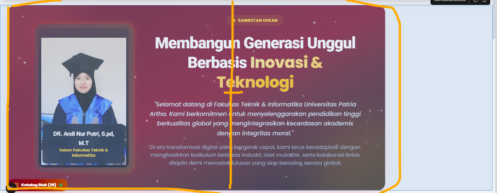

#### E.2 Pengujian Card Ilustrasi Program Studi (`ProdiIlustrasiBlock`)
Tangkapan layar pengujian komponen visual 3 Program Studi (Teknik Mesin, Teknik Elektro, Teknik Informatika) dengan latar gambar Unsplash HD, efek *hover zoom*, dan *dark multi-stop gradient overlay*.

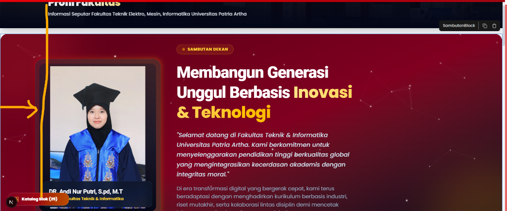

#### E.3 Pengujian Blok Sambutan Pimpinan Rata Tengah (`SambutanBlock`)
Tangkapan layar pengujian `SambutanBlock` dengan foto profil utuh tanpa terpotong (*contain fit*), opsi lebar kontainer (`max-w-6xl`), posisi rata tengah (*center align*), dan animasi teks *gradient shift*.

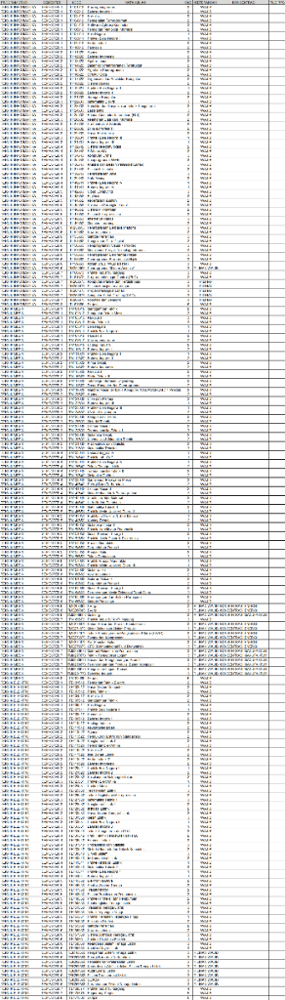

#### E.4 Pengujian Canvas Visual Page Builder Drag & Drop Editor
Tangkapan layar antarmuka utama Visual Page Builder berbasis Puck Engine dengan panel inspektor Elementor-style di sisi kanan.

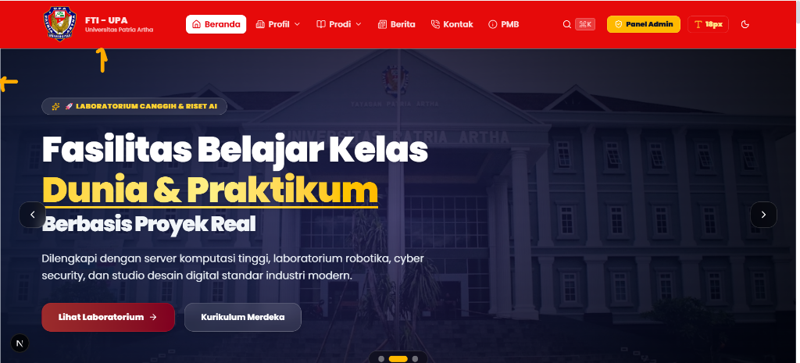

#### E.5 Pengujian Interactive Org Chart SVG (`Struktur_Block`)
Tangkapan layar pengujian bagan struktur organisasi hierarki Fakultas Teknik & Informatika UPA berbasis SVG Canvas interaktif dengan fitur Zoom & Pan.

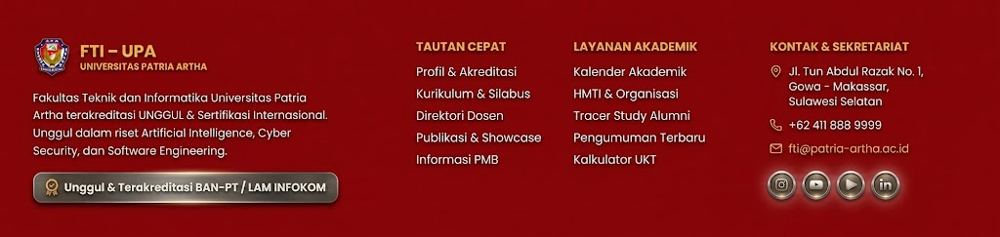

#### E.6 Pengujian Modal Detail Profil Pejabat Struktural
Tangkapan layar modal popup yang muncul saat mengklik card pejabat pada bagan struktur organisasi.

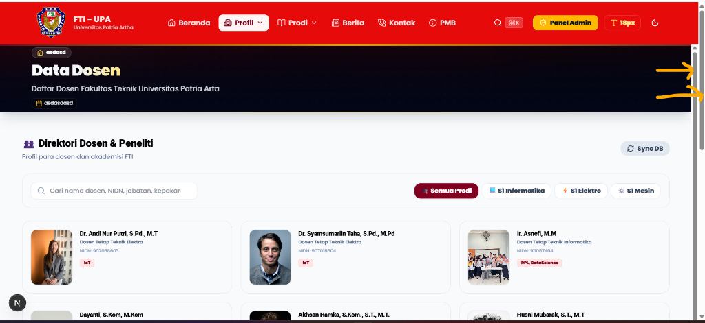

#### E.7 Pengujian Pratinjau Responsif Viewport (Mobile & Tablet)
Tangkapan layar pratinjau responsivitas antarmuka pada viewport layar peranti seluler (*mobile 375px*).

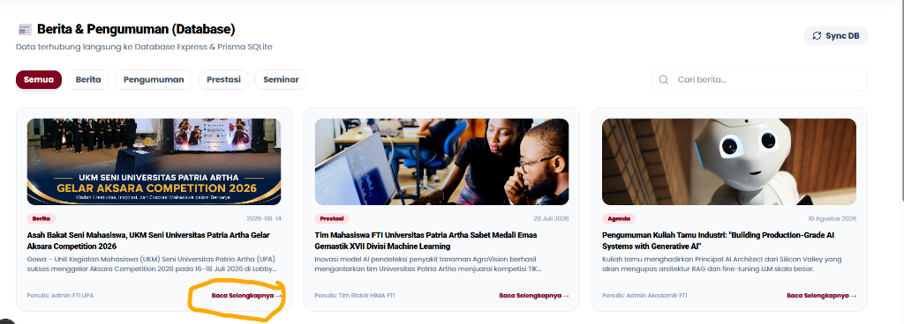

#### E.8 Pengujian Live News Carousel & Database Integration
Tangkapan layar pengujian integrasi data berita live database & carousel pengumuman akademik.

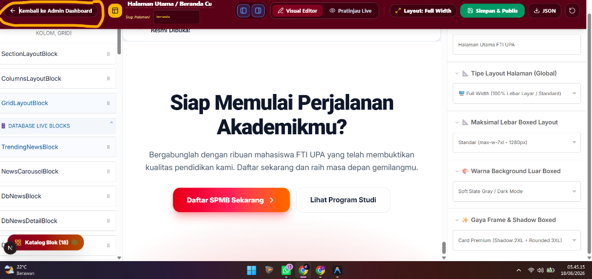

#### E.9 Pengujian Static Type Checking Terminal Compiler
Tangkapan layar hasil eksekusi pengujian kompilasi statis TypeScript (`npx tsc --noEmit`) yang mengindikasikan 0 error (Exit Code 0).


---
*Laporan Skripsi / Tugas Akhir ini disusun secara sistematis untuk memenuhi standar dokumentasi akademik Fakultas Teknik & Informatika Universitas Patria Artha.*
